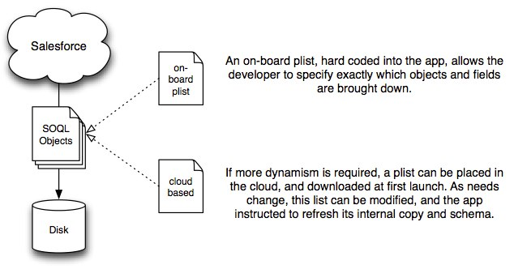

#RESTframework (iOS Sync Engine)

The RESTframework is an iOS framework for automatically synchronizing data from the Force.com REST APIs to and from iOS mobile devices.

##Proprietary Material

**Note: Everything contained in this repository is the private property of Salesforce.com.** Nothing contained within this repository should be shared externally to the company, except as a deliverable in a paid Salesforce Services engagement.

Do not email code or post on Chatter. Access is to be granted via Source Control only.

In the event this code is to be delivered to a Salesforce Services client, the [Code Delivery Checklist](https://org62.my.salesforce.com/06930000003GQNY) must be followed.

##Features

RESTframework implements:

* Full or partial object syncing
* Dependent pick lists
* Full metadata-based downloads
* Push data back up to server
* Full ARC compatibility 
* Core Data backed offline storage and access
* AES 256 bit hardware-backed encryption

##Mainline Branches

Please do not commit any changes directly to **master** branch. Follow this procedure:

* **master** : main branch -- use this for projects
* **staging** : code that is ready for testing prior to being promoted to master
* **dev** : feature development occurs here

Additionally, topic branches can be created at will, and merged into **dev** and **staging** prior to being merged into **master**.

###Merging to Master Branch

Do These Things when merging from **dev** or **staging** branches to **master**:

1. All new feature development is done in "dev" branch.
2. All emergency bugfixing is done in "hotfix" topic branch. This would be used for bugs that must be fixed in Master before the next planned merge from "Dev".
3. Any merge to master from either branch is accompanied by an update to Readme.md with a description of changes in the Changelog and a version # update.
4. Bugfix merges increment the version number by 0.0.1 (so 1.0.0 would change to 1.0.1)
5. Feature dev merges increment the version number by 0.1.0 (1.0.1 would change to 1.1.0).
6. Post any updates to Master branch to the **Chatter Group** in Org62 named "MM RESTFramework - iOS Sync Engine".
7. **Tag** the version with a Git Tag.

##Overview

The RESTframework is based on top of the existing open source [Salesforce Mobile SDK for iOS](https://github.com/forcedotcom/SalesforceMobileSDK-iOS).

The library uses the REST calls in the Salesforce SDK to download data from and upload data to Salesforce.com; this data is persisted in a dynamically created Core Data store (built using SQLite).

After pulling down the objects from Salesforce, Core Data relationships are established between various entities, creating a robust object graph of the pertinent data.

When editing or creating new objects, snapshots are taken, and only modified data is pushed back up to the server.

The entire framework is thread-aware and multithreaded, to ensure that communications and parsing operations don't block the UI.

The framework supports many common Salesforce patterns, such as:

* one-to-one and one-to-many relationships
* data-dependent and record type-dependent pick lists
* delta updates based on modification date
* dynamic record contents based off of describeObject meta data
* support for dynamic and flexible layouts using describeLayout meta data

##Configuration

After the initial metadata download, an MM:RSF based application will create a local Core Data store based off of a provided plist (property list, an XML format used widely within iOS). This plist contains a listing of objects to be synced, and queries to specify which fields on pertinent objects which should be brought down.

###sync_objects.plist

Take a look at the [example plist file](Examples%20%26%20Docs/sync_objects.plist).

Full documentation for sync_objects.plist is located here: [sync_objects.plist documentation](https://tig2.modelmetricssoftware.com/restframework/wikis/index)

The Objects array is a list of dictionaries, one for each object you'd like to sync.

* The "name" field holds the SalesForce name of the object.
* By default, ALL fields in ALL objects will be synchronized
* If present, an "ignore" array can hold a list of fields to ignore
* Similary, an "only" field lists ONLY those fields that should be pulled down.
* An "indexes" array contains a list of fields that should be indexed in Core Data
* An "add" array will add additional fields. Each field should be comprised of:
	* "name": the name of the field
	* "type": "string", "int", "float", "data", "transform", "bool", or "date" (defaults to "string")
	* "index": "YES" or "NO" (defaults to "NO")
* a "write-only" boolean, set to "YES" if you don't want to download data for the object (perhaps it's a large dataset, and you only want to be able to create new instances)
* a "skip-autosync" boolean, set to "YES" if you don't want to download data fields during a standard sync.
* Note that all fields will have columns created in the database, even if they're not synchronized.
* "Dependencies" contains a comma-separated list of other objects that must be fully downloaded before the current object can sync.
* "Filter" contains a SOQL query (after the WHERE clause) that can be used to pare an object query down to a more manageable size.
* By default, when new objects are created, they're reloaded from the server to ensure any server-auto-populated are up-to-date. To disable this, set "no-reload-on-creation" to true.
* After the sync is complete, all relationships are hooked up using Core Data relationships. To disable this for a particular object, set "post-sync-link" to true.
	
At first launch, an MM:RSF based application will create a local Core Data store based off of a provided plist (property list, an XML format used widely within iOS). This plist contains a listing of objects to be synced, and queries to specify which fields on which pertinent objects should be brought down.

This plist can be either included with the application at build-time, or brought down from the cloud when needed (or a combination of these two).

After the initial synchronization, the plist filters will be used for all subsequent sync operations, with the addition of an additional clause to restrict the queried objects to only those that have been modified since the last sync.

##Initial Setup

* Step 1: Clone this Repository. 
* See the demo/example project here: [SOQL Browser](Examples & Docs/SOQLBrowser)
* Use this project as a starting point / template: [RESTStarter](Examples & Docs/RESTStarter)

##Library Stack

#Detailed Setup

When using the MM_RSF, a few set up steps are required.

###1. Generate a list of objects to pull down. 

This can be provided via a variety of methods (included in the app, downloaded, etc). By default, if present, a sync_objects.plist is used. To use your own, call the -[MM_OrgMetaData setAllObjectsToSync:] method and pass your array of objects. 

Each object in your array is comprised of a dictionary. The only required field is "name", which is is the API name of the object you want to pull down. By default, ALL objects, and ALL fields on those objects, are pulled down. The following fields let you custom these behaviors:

	filter			This is a "where" statement that gets passed when querying for objects.
					ex. "Status__c = 'Open'"		(omit the double quotes)
					
	onlyList		the list of fields to pull down, in case you don't want ALL of them
	
	ignoreList		fields to skip (such as large data fields).
	
	extra-query		fields to add to the query
	
	extra-device	fields that are created for on-device storage only
	
	fetch-limit		passed in to SOQL queries as the LIMIT option

	fetch-order		passed in to SOQL queries as the ORDER option

	disable-initial-blob-download	set this to YES to disable downloading attachments, documents, and other data blobs during the initial sync process
	

###2. In your -[appDelegate didFinishLaunching:] method, you'll want to call +[MM_LoginViewController presentModallyInParent:], and pass in the root view controller

You'll also need to set the redrectURI, loginDomain, and remoteAccessConsumerKey properties. Optionally, you can set a preloadedUsername and preloadedPassword for testing. The canCancel, canToggleServer, and useTestServer are all also useful in testing, and are documented in the class header file.

###3. When the user logs in and grants access, the MM_LoginViewController will post a kNotification_LoginComplete notification. Here is where you can initiate your initial synchronization procedure, to pull down data for offline use.

Here's a sample method that first checks to make sure the object list has been downloaded, then checks for all required meta data, and finally performs the sync:

	- (void) loginComplete {
		MM_SyncManager			*syncMgr = [MM_SyncManager sharedManager];
	
		[SA_ConnectionQueue sharedQueue].activityIndicatorCount++;
		if (![MM_OrgMetaData sharedMetaData].areAllObjectsToSyncPresent) {
			[syncMgr downloadObjectDefinitionsWithCompletionBlock: ^{
				[syncMgr fetchRequiredMetaData: NO withCompletionBlock: ^{
					if ([MM_Config sharedManager].startupSyncRequired) 
						[syncMgr synchronize: nil withCompletionBlock: completionBlock];
					[SA_ConnectionQueue sharedQueue].activityIndicatorCount--;
				}];
			}];
		} else {
			[syncMgr fetchRequiredMetaData: NO withCompletionBlock: ^{
				if ([MM_Config sharedManager].startupSyncRequired) 
					[syncMgr synchronize: nil withCompletionBlock: completionBlock];
				[SA_ConnectionQueue sharedQueue].activityIndicatorCount--;
			}];
		}
	}

Note: there are a few nested blocks, as each step is required before the next one can take place. There are other ways to do this (such as a state machine), but this is the most compact.

###4. By default, all synchronizations after the first are deltas, using a lastModifiedDate filter on the SOQL query. 

To perform a standard (delta) sync, simply call -[MM_SyncManager synchronize:withCompletionBlock:], and pass a list of MM_SFObjectDefinitions as the first argument. You may also pass nil to use your list of all objects to sync.

If you'd like to re-pull ALL data down, you may call -[MM_SyncManager fullResync:withCompletionBlock:].

###5. The framework makes extensive use of the parent/child context relationship structure made possible by iOS 5. 

For simplicity and thread safety, never access [MM_ContextManager sharedManager].mainContentContext directly; instead, call -[MM_ContextManager contentContextForWriting].

###6. To edit an object, create a local context for the object and retrieve that context's version of the object. 

Before presenting any editing UI or changing fields, call -beginEditing on that object. This makes a copy of all fields and relationships present in the object. When editing is complete, call -finishEditingSavingChanges:, passing either YES to save changes (and push them up to the server) or NO. Changes will be pushed up to Salesforce immediately if online, or the next time a connection is available.

#Process Flow

Initial Sync and Record Update Flow

###Miscellaneous Development Notes

If you would like to pre-fill a username and password into the OAuth credentials for (for testing purposes only), you can add environmental variables to your configuration. These should be __PRELOADED_USERNAME__ and __PRELOADED_PASSWORD__.

To avoid overlong queries, you should avoid the SOQL construct "SELECT xyz IN Account WHERE Id IN (long list of Ids))". Instead, when you need to filter by a list of Salesforce IDs, use the [query filterForIds: idsToFilterOn inField: @"Id"] method. 
